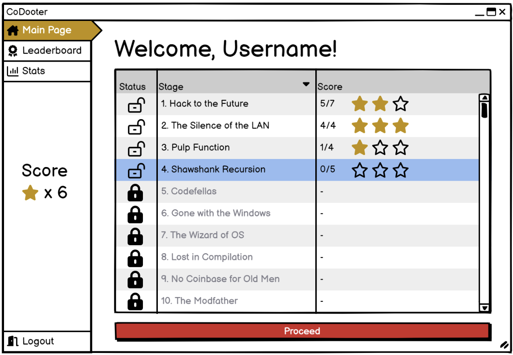

# CoDootor :: Just Codin'

## Team members: Chris Tang, Cinar Ozkul, Leo Kim, Jeffrey Ho



CoDootor is an education tool that will help students to learn how to code by improving their code comprehension skills. Students will attempt problems where they are given a piece of code and are asked to provide a written description of what the purpose of the function is. After providing a description, their description is sent to a large language model (LLM) which will produce code based on the user’s given description. Then the server checks if the code produced by the LLM is functionally equivalent to the provided code by running test cases against the LLM code. If all the test cases pass, then it is deemed functionally equivalent. If not, then the user is informed of what test cases failed and they will be able to update their description to retry the problem.

## Setup and Configuration Details
### Front-End
ReactJS and NodeJS will be used to render the webpage. 
### Backend
Our backend is designed to handle core functionalities and data management for the application. This consists of JSON files for data storage, REST API to various CRUD operations, and integration with authentication and LLM processing.
#### Data Storage
Our data will be stored in JSON files for both the question/test bank and user information.
 - Question/Test Bank may have a unique identifier for each question, text description, and statistical numbers as its data. This will be parsed with our REST API to retrieve and update questions.
 - User Information may have username, user’s progress information, and statistical numbers as its data. This will be parsed with our REST API to retrieve and update user information.

#### Authentication
Our user authentication will be managed with Auth0, this will be approached with our REST API to secure user data.
API will handle user login and its hashed token to validate their login information.
#### REST API
REST API works as a server between frontend and backend to deliver requests. This will handle various CRUD functionalities, such as user authentication, question retrieval, processing user inputs, and updating user information.

#### Interaction with Ollama
Our backend will use Granite-code:3b via Ollama. REST API will handle this interaction with parsing user requests to Ollama and returning the generated results.

#### Problem Logic
**Game Flow Control** manages the progressions of each question based on user interactions. This function may include controlling game state, managing user inputs and results.

**Generate Functions** and Run Test Cases generates the function as user requested and runs pre-defined tests to evaluate user understanding, this may include generating and retrieving generated code from user requests and executing and testing cases to verify its correctness.

**Update User Scores** updates user scores based on test case results. This may include calculating and updating scores to the user information and storing it into the JSON file.

**Pass User Prompts** to API sends user prompt requests to REST API to run Ollama. This may include processing user inputs to send to our API endpoint to get the result from Ollama.


### Prerequisites
- Docker
- Docker Compose
## Docker Compose (Installation)
1. **Clone the repository:**
    ```sh
    git clone https://github.students.cs.ubc.ca/CPSC310-2024S/Project-Groups-19-Lab-B.git
    cd Project-Groups-19-Lab-B
    ```

2. **Start the Docker containers:**
    ```sh
    docker-compose up --build
    ```

3. **Access the application:**
 - Backend API: `http://localhost:5001`
 - Frontend: `http://localhost:5173`
 - Frontend Test Credentials:
     - Email: testuser@test.com
     - Password: Test123!

### Test Suite
**Frontend Testing**: [Document](https://docs.google.com/document/d/1UHnr5hNPltCYQ_K-Hptvbo2ccVuPOCVeVaGwEgdP3oU/edit?usp=sharing)

**Backend Tests** (*Requires tests to finish running first in Docker*): [Backend Test Summary Page](http://localhost:5001/tests)
